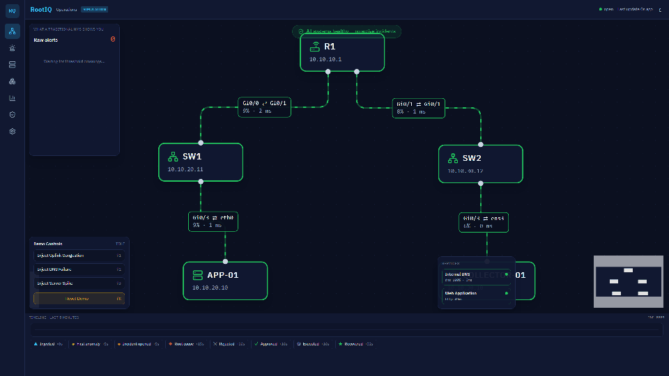

# RootIQ

**Find the cause before it becomes an outage** — alert storm → one incident → evidence-backed RCA → engineer approve-only remediation in under 60 seconds.



[](https://github.com/Muath477/frast1/actions/workflows/ci.yml)

Venture X Hackathon — Infrastructure & Cloud · Mode: **sim-first** (live EVE-NG additive)

---

## What's new on the `my-edits` branch

> You are reading the `my-edits` branch. If GitHub shows an older README, you are on `main`: use the branch selector (top left) and pick **`my-edits`**. Full history: [`CHANGELOG.md`](CHANGELOG.md).

### Agents: **16** (previously 14)

Per-agent details: [`docs/AGENTS.md`](docs/AGENTS.md).

### Supported vendors

43 vendors in the knowledge base. Full table with every vendor: [`docs/VENDORS.md`](docs/VENDORS.md).

| Vendor | OS families | Coverage | Confidence |
|---|---|---|---|
| Cisco | IOS XE, IOS, NX-OS, IOS XR | full | high |
| Juniper | Junos | full | high |
| Arista | EOS | full | high |
| HPE Aruba | AOS-CX, ArubaOS-Switch | full | medium |
| Huawei | VRP | full | medium |
| Fortinet | FortiSwitchOS, FortiOS | partial | low |
| Dell | OS10, DNOS6, OS9 | partial | medium |
| Extreme | EXOS, VOSS | partial | medium |
| MikroTik | RouterOS, SwOS | partial | medium |
| NVIDIA | Cumulus, ONYX | partial | medium |
| H3C | Comware | partial | medium |
| Linux servers | Linux | partial | medium |
| 31 more (TP-Link, D-Link, Netgear, Zyxel, Ubiquiti, Nokia, Palo Alto, Check Point, ...) | — | identification only | — |

*Coverage*: **full** = curated commands and identification rules; **partial** = some of them; **identification only** = the vendor and OS are recognized but no commands are curated (RootIQ says so instead of guessing).

### Everything else that was added

| Area | Summary | Read |
|---|---|---|
| Vendor knowledge base | 43 vendors · 59 OS families · 103 device series · 25 problem patterns · coverage and confidence stated per vendor | [`docs/VENDORS.md`](docs/VENDORS.md) |
| Priority vendors | Cisco (the lab), Juniper, Fortinet, Aruba, Arista: command syntax, **how a change is saved** (`write memory` / `commit` / auto-save), rollback, CLI style | [`docs/VENDORS.md`](docs/VENDORS.md) §3b |
| Syslog | `POST /api/syslog` (same ingest token as `/api/events`) | [`docs/AGENTS.md`](docs/AGENTS.md) §4.15 |
| Copilot | Answers command, problem and save-config questions for up to 4 vendors side by side, verbatim from the knowledge base, with sources | [`docs/AGENTS.md`](docs/AGENTS.md) §4.9 |
| UI | Incident plan shows **Vendor diagnostics** and **Applying a change**; the Agents page lists all 16 agents | `frontend/src/components/incidents/VendorCommands.tsx` |
| Training | `training/`: generated dataset (about 4.7k EN/AR examples, 10 tasks), offline evaluator, Hugging Face catalog, Colab notebook | [`training/README.md`](training/README.md) · [`docs/AI_TRAINING.md`](docs/AI_TRAINING.md) |
| Mixed-vendor lab | Example topology: Cisco + Juniper vQFX + Arista vEOS + FortiGate-VM + Aruba AOS-CX | [`configs/topology.multivendor.example.json`](configs/topology.multivendor.example.json) |
| Tests | 282 backend tests (151 before) | `cd backend && pytest -q` |

### Honest limits

- The knowledge base is **not exhaustive**: 5 vendors with full coverage, 7 partial, 31 identification-only. Devices are known by **family/series**, not by every SKU.
- Commands and syslog patterns were written from general knowledge, not captured from real devices. Every vendor carries a confidence level; **Fortinet is the weakest**.
- RootIQ shows vendor commands to the engineer and never pushes them to a device.
- Training: the notebook ran end to end on Colab once in SMOKE mode (20 training steps: data, QLoRA, evaluation, merge and export to Drive); that only proves the pipeline works. The full run (`SMOKE = False`) has not been done, so there is no real accuracy result yet. First smoke numbers and the problems met on Colab: [`docs/AI_TRAINING.md`](docs/AI_TRAINING.md) §8–§9.

<div dir="rtl">

### الملخص بالعربي

**عدد الوكلاء: 16** (كانوا 14).

- **قاعدة المصنّعين:** 43 مصنّعًا، 59 نظام تشغيل، 103 عائلة أجهزة، 25 نمط مشكلة، وتغطية وثقة معلنتان لكل مصنّع.
- **Cisco وJuniper وFortinet وAruba وArista:** لكل نظام أسلوب كتابة الأوامر وطريقة حفظ الإعداد والتراجع عنه.
- **المساعد الذكي (Copilot):** يجيب عن الأوامر والمشاكل وحفظ الإعداد لعدة مصنّعين جنبًا إلى جنب، حرفيًا من القاعدة.
- **الواجهة:** خطة الحادثة تعرض «Vendor diagnostics» و«Applying a change».
- **التدريب:** مجلد `training/` فيه بيانات مولَّدة من القاعدة، ومقيّم آلي، وكتالوج Hugging Face، ودفتر Colab.
- **الاختبارات:** 282 اختبارًا.

**حدود صريحة:** القاعدة ليست شاملة (تغطية كاملة لخمسة مصنّعين فقط)، والأوامر لم تُلتقط من أجهزة حقيقية (Fortinet أضعفها ثقةً)، وRootIQ يعرض الأوامر للمهندس ولا ينفّذها.

</div>

### Try it in 2 minutes (backend running)

```bash
# 1) Identify a device from its sysDescr
curl -s -X POST localhost:8000/api/vendors/identify -H 'content-type: application/json' \
  -d '{"sysDescr":"Juniper Networks, Inc. ex4300-48t Ethernet Switch, kernel JUNOS 21.4R3-S5.4, Build date: 2023-06-01 10:00:00 UTC Copyright (c) 1996-2023 Juniper Networks, Inc."}'

# 2) A syslog line opens an incident (same token as /api/events)
curl -s -X POST localhost:8000/api/syslog -H 'content-type: application/json' -H 'x-rootiq-token: change-me-ingest' \
  -d '{"device":"r1","lines":["%LINK-3-UPDOWN: Interface GigabitEthernet0/0, changed state to down"]}'

# 3) Ask the Copilot how several vendors save a configuration
curl -s -X POST localhost:8000/api/copilot/ask -H 'content-type: application/json' \
  -d '{"question":"How do I save the config on Junos vs Cisco vs Fortigate?"}'
```

---

## كيف تشغّل المشروع / How to run

### أول مرة فقط (once)

```powershell
cd e:\frast1\backend
python -m venv .venv
.\.venv\Scripts\Activate.ps1
pip install -r requirements.txt

cd e:\frast1\frontend
npm install
```

### كل مرة (every time) — طرفيتان

**1) Backend (sim)**
```powershell
cd e:\frast1\backend
.\.venv\Scripts\Activate.ps1
$env:ROOTIQ_MODE = 'sim'
uvicorn app.main:app --host 127.0.0.1 --port 8000
```

**2) Frontend** (طرفية ثانية)
```powershell
cd e:\frast1\frontend
npm run dev
```

**3) افتح المتصفح**
- UI: http://localhost:5173
- API health: http://localhost:8000/api/health

### ديمو سريع
`Shift+P` Presenter · `Shift+1` ازدحام · Reject / Approve · `Shift+R` إعادة

### Docker (اختياري)
```powershell
cd e:\frast1
docker compose up -d --build
# UI http://localhost:8080  ·  API http://localhost:8000
./scripts/preflight.sh
```

### نشر عام (رابط للمشاركة)
**الآن (نفق Cloudflare — اللابتوب لازم يظل شغّال):** الرابط يظهر من `cloudflared tunnel --url http://127.0.0.1:5173`

**دائم (Render — باك+فرونت في صورة واحدة):** ادفع الريبو ثم افتح  
https://dashboard.render.com/select-repo?type=blueprint  
واختر `iksasa15/frast1` (يستخدم `render.yaml` + `Dockerfile`).

## Architecture

Lab collector → FastAPI ingest → detect/correlate/RCA/explain → WebSocket UI → approve → whitelisted lab agent.

Full Mermaid + 30s verbal: [`docs/ARCHITECTURE.md`](docs/ARCHITECTURE.md)

## Multi-agent layer

**16 agents**, plus a read-only bilingual **Copilot** with a local **RAG** index. Nothing runs without a named engineer's approval. The LLM (Claude / Gemini / Groq) is optional and can only reword text with numbers grounded in measurements.

- Per-agent benefit, needs, guardrails and failure behaviour: [`docs/AGENTS.md`](docs/AGENTS.md)
- Big picture, spec compliance matrix, gaps, roadmap: [`docs/BLUEPRINT.md`](docs/BLUEPRINT.md)
- Vendor knowledge base (identity from `sysDescr`/`sysObjectID`, per-vendor read-only diagnostics, syslog formats, 25 problem patterns): [`docs/VENDORS.md`](docs/VENDORS.md)
- UI: **Agents** page (roster, live trace, Copilot) · API: `GET /api/agents`, `POST /api/copilot/ask`
- One command (Windows): `powershell -ExecutionPolicy Bypass -File .\scripts\run-demo.ps1` starts the backend + UI in simulation mode and opens the Agents page. Optional LLM: `$env:GROQ_API_KEY='...'` then add `-Llm groq` (the key is read from the environment and never stored). Stop with `-Stop`.

## Modes

| | |
|---|---|
| `ROOTIQ_MODE=sim` | In-process simulator (default, offline, backup) |
| `ROOTIQ_MODE=live` | EVE-NG + COLLECTOR-01 + lab agent |

UI badge always shows the active mode.

## Measured results

From `GET /api/runs` (9 sim runs) — details in [`docs/RESULTS.md`](docs/RESULTS.md):

| Metric | Target | Measured |
|---|---|---|
| Time to RCA | &lt; 60 s | **12.3 s** |
| Top-1 root | Top 3 | **9/9** |
| Noise reduction | 30% | **96.3%** |
| Human approval | 100% | **100%** |

## Pitch & demo

- Deck: [`docs/RootIQ_Pitch_Deck_Final.pptx`](docs/RootIQ_Pitch_Deck_Final.pptx) (numbers from RESULTS)
- **Demo day runbook:** [`docs/RUNBOOK.md`](docs/RUNBOOK.md)
- Script: [`docs/DEMO_SCRIPT.md`](docs/DEMO_SCRIPT.md) · Q&A: [`docs/QA_BANK.md`](docs/QA_BANK.md)
- Risks · compressed plans · solo path: [`docs/RISKS.md`](docs/RISKS.md) · [`COMPRESSED_PLANS.md`](docs/COMPRESSED_PLANS.md) · [`SOLO_PATH.md`](docs/SOLO_PATH.md)
- Rehearsal / bag: [`docs/REHEARSAL.md`](docs/REHEARSAL.md) · [`docs/BAG.md`](docs/BAG.md)
- Backup video: [`docs/demo-backup.md`](docs/demo-backup.md)
- Full docs index: [`docs/README.md`](docs/README.md)
- Ship tag: **`v1.0`**

## Demo hotkeys

Shift+1 uplink · Shift+2 DNS · Shift+3 server spike · Shift+R reset · Shift+P presenter

## Team

| Role | Who |
|---|---|
| FE / keyboard demo | Ahmed |
| BE / AI / INFRA / Presenter | Team (see kickoff) |

## GitHub automation

| What | Where | Does |
|---|---|---|
| CI | [`.github/workflows/ci.yml`](.github/workflows/ci.yml) | On every push to `main` / `my-edits` and every pull request: backend tests, frontend type-check + tests + build, and checks that the knowledge base, the generated training data and `docs/VENDORS.md` are in sync, plus a wiring audit ([`scripts/audit_wiring.py`](scripts/audit_wiring.py)) |
| Copilot agent environment | [`.github/workflows/copilot-setup-steps.yml`](.github/workflows/copilot-setup-steps.yml) | Installs Python and Node dependencies so the Copilot coding agent (the **Agents** tab) can run the tests |
| Copilot instructions | [`.github/copilot-instructions.md`](.github/copilot-instructions.md) | Repository rules for any Copilot agent: human approval only, read-only vendor commands, no invented vendor facts, no secrets, pull requests to this fork only |
| Custom agents | [`.github/agents/`](.github/agents) | `vendor-kb` (maintains the vendor knowledge base) and `docs-keeper` (keeps README, CHANGELOG and docs consistent) |
| Pull request template | [`.github/pull_request_template.md`](.github/pull_request_template.md) | Checklist: tests, regenerated data, no secrets, docs |

## Tests & training data

```powershell
cd backend
$env:ROOTIQ_MODE = 'sim'
.\.venv\Scripts\python.exe -m pytest -q                        # 282 tests
cd ..\frontend; npx tsc --noEmit; npx vitest run src           # type-check + unit tests
cd ..; python training\build_dataset.py --check                # committed training data matches the knowledge base
python scripts\audit_wiring.py                                 # runs the API on the multi-vendor topology; docs, counts, notebook and frontend agree with the code
```

## Docs

Index: [`docs/README.md`](docs/README.md) · Full plan: `RootIQ_Daily_Plan.md` · Progress: `docs/progress/` · What changed: [`CHANGELOG.md`](CHANGELOG.md)

| Read this | For |
|---|---|
| [`docs/AGENTS.md`](docs/AGENTS.md) | The 16 agents: benefit, needs, guardrails, failure behaviour, API, tests; what was added or modified for multi-vendor support (§4b) |
| [`docs/VENDORS.md`](docs/VENDORS.md) | Vendor knowledge base: coverage table, config model per vendor (§3b), how to add a vendor, honest limits |
| [`docs/BLUEPRINT.md`](docs/BLUEPRINT.md) | Big picture, spec compliance, gaps, roadmap |
| [`docs/AI_TRAINING.md`](docs/AI_TRAINING.md) · [`training/README.md`](training/README.md) | What to train and why, the generated dataset, the evaluator, Hugging Face catalog, the Colab notebook |
| [`docs/ARCHITECTURE.md`](docs/ARCHITECTURE.md) | Diagram + 30-second explanation |

## Feature freeze

After Day 11 / `v1.0-rc1`: **no new features** — bugfixes only with two-person review.
