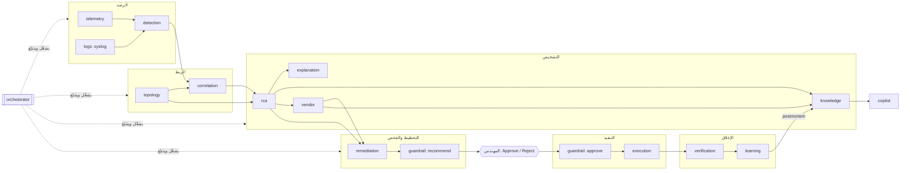

# وكلاء RootIQ (Multi-Agent) — الدليل الكامل

> **الفكرة في سطر:** بدل «نموذج ذكاء اصطناعي واحد يفعل كل شيء»، RootIQ فيها **16 وكيلًا متخصصًا**، لكل وكيل مهمة واحدة وأدوات محدودة وأثر (trace) يمكن تدقيقه — وقرار التنفيذ **دائمًا** بيد المهندس.
>
> الكود: `backend/app/agents/` · الواجهة: صفحة **Agents** (أيقونة الروبوت) · الاختبارات: `backend/tests/test_agent*.py` `test_guardrail.py` `test_copilot.py` `test_rag.py` `test_knowledge_base.py` `test_vendor_agents.py`

---

## 0. الجدول السريع

| # | الوكيل (`id`) | الطبقة | مستوى الاستقلالية | الفائدة في جملة | LLM؟ |
|---|---|---|---|---|---|
| 1 | `orchestrator` المنسّق | إشراف | ينسّق | لا يوقف فشلُ وكيلٍ واحد الحادثةَ كلها، والمسار كله قابل للتتبع | لا |
| 2 | `telemetry` القياسات | رصد | يراقب | يمسك البيانات السيئة/القديمة قبل أن تصير حادثة كاذبة | لا |
| 3 | `detection` الكشف | رصد | يراقب | يكتشف العطل خلال ثانية بدون بيانات تدريب | لا |
| 4 | `logs` السجلات (Syslog) **جديد** | رصد | يراقب | يلتقط سقوط منفذ من سجل الجهاز نفسه، بصيغ Cisco/Juniper/Arista/Huawei/MikroTik… | لا |
| 5 | `topology` الطوبولوجيا | استدلال | يراقب | يجيب «ماذا ينكسر لو بطؤ هذا الرابط؟» من الرسم لا من التخمين | لا |
| 6 | `vendor` معرفة المصنّعين **جديد** | معرفة | ينصح | يعرف مصنّع كل جهاز ونظامه وإصداره ويعطي أوامر الفحص بلغته (قراءة فقط) | لا |
| 7 | `correlation` الربط | استدلال | يراقب | عشرات التنبيهات → حادثة واحدة (~96% تقليل ضجيج) | لا |
| 8 | `rca` السبب الجذري | استدلال | ينصح | أفضل 3 أسباب بأدلة ونسبة ثقة، ويقول «لا أعرف» عند الشك | لا |
| 9 | `explanation` الشرح | استدلال | ينصح | شرح عربي/إنجليزي بلا أي رقم مختلق | اختياري |
| 10 | `knowledge` المعرفة (RAG) | معرفة | يراقب | يسترجع حوادث سابقة وخطوة الـrunbook وكتالوج المصنّعين والمشاكل مع المصدر | لا |
| 11 | `copilot` المساعد | معرفة | ينصح | اسأل بدل التنقل بين اللوحات (وعن أوامر أي مصنّع)، وكل ادعاء له مصدر | اختياري |
| 12 | `remediation` مخطِّط المعالجة | إجراء | ينصح | المهندس يوافق على خطة محددة قابلة للتراجع (مع أوامر مصنّع الجهاز المرجعية) | لا |
| 13 | `guardrail` الحماية | حوكمة | ينسّق | «لا شيء يُنفَّذ بدون مهندس» قاعدة في الكود، وأوامر التشخيص للقراءة فقط | لا |
| 14 | `execution` التنفيذ | إجراء | ينفّذ بموافقة فقط | المكوّن الوحيد الذي يلمس المختبر، ويرفض بدون حكم Guardrail | لا |
| 15 | `verification` التحقق | إجراء | يراقب | التعافي يُثبَت بالأرقام لا يُفترض | لا |
| 16 | `learning` التعلّم وما بعد الحادثة | تعلّم | ينصح | كل حادثة تجعل التالية أسرع، وتقرير جاهز للفريق | لا |

**14 من 16 وكيلًا حتمية (Deterministic) بالكامل.** الـLLM يدخل في `explanation` و`copilot` (إعادة صياغة)، وفي `knowledge`/`vendor` كـ**مرجع استشاري** فقط عند فراغ قاعدة المعرفة — وبشرط أن كل رقم في النص موجود في الحقائق المقاسة، وإلا يُرفض.

---

## 1. لماذا Multi-Agent؟ (القرارات التصميمية)

### 1.1 ما الذي يجعل الشيء «وكيلًا» عندنا
وحدة تحقق كل ما يلي:
1. **مهمة واحدة** واضحة (مكتوبة في `roster.py`: mission / benefit).
2. **مدخلات ومخرجات صريحة** (لا تقرأ حالة عشوائية).
3. **أدوات محدودة** (قائمة `tools`) — لا shell حر.
4. **أثر (Trace Step)** لكل عمل مهم: من، ماذا، كم مللي ثانية، ماذا قرر، لماذا.
5. **خطة بديلة** عند الفشل أو التعطيل (انظر §3.4).

### 1.2 لماذا لا «وكلاء LLM مستقلون»؟
| السؤال | وكلاء LLM حرة | نهجنا (Deterministic first) |
|---|---|---|
| الدقة | قد تهلوس أرقامًا/أوامر | الأرقام من القياسات فقط، والـLLM يعيد الصياغة فقط |
| قابلية التدقيق | صعب إعادة إنتاج القرار | نفس المدخلات → نفس النتيجة، والدرجات مفصّلة |
| الأمان | قد «تقرر» تنفيذ أمر | لا وكيل ينفّذ إلا بعد موافقة إنسان + حكم Guardrail |
| بدون إنترنت / بدون مفتاح | لا يعمل | كل شيء يعمل، والـLLM ميزة إضافية |
| الاستضافة المحلية (سيادة البيانات) | يرسل بيانات للخارج | افتراضيًا لا يخرج أي شيء |

### 1.3 ثلاث قواعد ذهبية
1. **Advisor ≠ Actor:** الوكلاء ينصحون (`advise`) أو يراقبون (`observe`). الوحيد الذي يغيّر شيئًا هو `execution`، وبعد بوابة الإنسان.
2. **Human gate:** أي `approve/reject` يجب أن يأتي من **اسم إنسان**؛ `system`, `agent:*`, `copilot`, `orchestrator`… مرفوضة (HTTP 403).
3. **Fail closed:** لو تعطل `guardrail` نفسه (استثناء) → لا تنفيذ. وإن غاب حكمه → `execution` يرفض.

---

## 2. الخريطة الكاملة



### ترتيب الخطوات الفعلي في الحادثة (من تشغيل حقيقي لهذا البناء)

| الوقت | الوكيل.العمل | النتيجة |
|---|---|---|
| +0.0s | `correlation.open_incident` | أول عرَض `link-r1-sw1.if_out_discards_rate` — فُتحت INC-0001 |
| +10.0s | `telemetry.assess_sources` | 3 مصادر حديثة، جودة البيانات 100% |
| | `correlation.collapse_storm` | 39 عرَضًا خامًا في 3 عناصر ← حادثة واحدة (97% تقليل ضجيج) |
| | `topology.scope_dependencies` | 3 عناصر تؤثر على خدمتين: `svc-dns`, `svc-web` |
| | `rca.rank_causes` | السبب: R1 Gi0/0 → SW1 Gi0/1 بثقة 90%، والثاني Internal DNS (0.39) |
| | `detection.multivariate_score` | skipped — لا يوجد نموذج Isolation Forest مدرّب (اختياري) |
| | `explanation.write_explanation` | شرح قالبي EN+AR |
| | `knowledge.retrieve_context` | 0 حادثة مشابهة، 3 مراجع |
| | `vendor.enrich_incident` | 2/2 جهاز مُعرَّف (R1 و SW1: Cisco IOS)، نمطان معروفان — الأول: Link congestion |
| | `orchestrator.investigate` | اكتمل التشخيص |
| | `remediation.plan_remediation` | `PB-LINK-QOS` مخاطرة low، 3 خطوات، تراجع معرّف، وأوامر فحص Cisco المرجعية لـGi0/0 و Gi0/1 |
| | `guardrail.policy_recommend` | فحوص السياسة نجحت (منها `vendor_commands_read_only`) |
| | `orchestrator.handoff_to_human` | **بانتظار المهندس — لا شيء سيعمل قبله** |
| بعد الموافقة | `guardrail.policy_approve` ← `execution.execute_playbook` | تنفيذ عبر المحاكي/وكيل المختبر المحصور |
| بعد التعافي | `verification.verify_recovery` ← `learning.close_out` ← `orchestrator.incident_closed` | تحقق 3/3 + تقرير + تحديث التاريخ |

> عند محاولة موافقة من `system` أو `agent:copilot` يظهر `guardrail.policy_approve` بحالة **denied** ويُسجَّل في Audit (`guardrail_denied`) — ولا يُنفَّذ شيء.

---

## 3. نموذج التشغيل (Runtime)

### 3.1 المكوّنات
| الملف | الدور |
|---|---|
| `agents/roster.py` | مصدر الحقيقة لوصف كل وكيل (bilingual) + مخطط الخط `FLOW/EDGES` |
| `agents/base.py` | `AgentSpec` · `TraceStep` · `TraceStore` · `Agent.step()` (يقيس الزمن، يسجل الأثر، يبثّه عبر WebSocket) |
| `agents/runtime.py` | `AgentRuntime`: ينشئ الوكلاء الـ16، يملك الـTraceStore ومفاتيح التعطيل، ويوفّر `roster()/flow()/health()` |
| `agents/orchestrator.py` | يشغّل التشخيص، `safe()` = مهلة + بديل، `handoff()` و`closed()` |
| `agents/playbooks.py` | كتالوج الـplaybooks المسموحة (القائمة البيضاء الوحيدة) |

### 3.2 بنية Trace Step
```json
{
  "id": "AS-000012", "agent": "rca", "action": "rank_causes", "incidentId": "INC-0001",
  "status": "ok | error | skipped | denied", "startedAt": "2026-09-28T19:43:10Z",
  "durationMs": 0.25, "summary": "top cause R1 Gi0/0 → SW1 Gi0/1 — confidence 90%",
  "data": { "confidence": 0.9, "candidates": [ ... ] }, "decision": "root_cause_selected"
}
```
يُبثّ كل Step على WebSocket بنوع `agent_step`، وتقرأ الواجهة السجل عبر `GET /api/agents/trace`.

### 3.3 مفاتيح التعطيل (Kill switches)
- `POST /api/agents/{id}/toggle` `{ "enabled": false, "actor": "Ahmed" }` — يُسجَّل في Audit.
- **قابلة للتعطيل:** `telemetry` `logs` `vendor` `explanation` `knowledge` `copilot` `verification` `learning`.
- **غير قابلة للتعطيل (403):** `orchestrator` `detection` `topology` `correlation` `rca` `remediation` `guardrail` `execution` — لأن تعطيلها إما يكسر التشخيص أو يُضعف الأمان.

### 3.4 جدول التدهور الآمن (ماذا يحدث عند الفشل/التعطيل)

| الوكيل | إذا عُطّل أو فشل أو تجاوز المهلة | أثر ذلك على الحادثة |
|---|---|---|
| `telemetry` | تُتخطى خطوة `assess_sources` (الفحص السريع للأحداث يبقى) | لا سياق حداثة للمصادر |
| `correlation.storm_summary` | تُتخطى الخطوة | الربط نفسه (`pick`) لا يتأثر |
| `topology.scope` | تُتخطى | RCA يكمل (يستخدم الرسم مباشرة) |
| `detection.multivariate` | تُتخطى | لا دليل Isolation Forest (كان داعمًا فقط) |
| `explanation` | **يُستخدم القالب** (`template`) | شرح EN/AR جاهز |
| `knowledge` | لا «حوادث مشابهة» ولا مراجع؛ إن فُعّل LLM قد يُرفق `aiReference` استشاريًا | الحادثة تكتمل |
| `rca` | الاستثناء يصعد؛ الحادثة تبقى `investigating` ويُسجَّل الخطأ | **حرج** — لذلك لا يُعطَّل |
| `guardrail` | أي استثناء ← الموافقة تفشل (fail closed) | لا تنفيذ |
| `execution` | `approvalStatus = failed` + Audit `execute_failed` | لا تعافٍ تلقائي |
| `vendor` | لا `vendorContext` ولا `vendorCommands`؛ إن فُعّل LLM قد يُرفق `aiReference` عند الفراغ | الحادثة والموافقة يكملان |
| `logs` | `POST /api/syslog` ← 503؛ القياسات الدورية تبقى | لا سقوط منفذ من السجلات |
| `verification` | `verification = null` | الإغلاق يكمل |
| `learning` | يُسجَّل `history` فقط بدون تقرير | الإغلاق يكمل |
| `copilot` | `/api/copilot/ask` ← 503 | لا أثر على الحادثة |

المهلة الافتراضية لكل وكيل: `AGENT_TIMEOUT_S=8`.

---

## 4. الوكلاء واحدًا واحدًا

> الترتيب هنا = ترتيب الجدول السريع (§0) و`ORDER` في `roster.py`.
> قالب كل قسم: **ماذا يفعل ← متى يعمل ← كيف يعمل خطوة بخطوة ← المدخلات/المخرجات ← مثال من الديمو ← الضوابط + عند الفشل ← الكود والاختبار.**

### 4.1 `orchestrator` — المنسّق

- **ماذا يفعل:** يشغّل التشخيص بترتيب ثابت، يطبّق مهلة وبدائل للوكلاء الاختياريين، ثم **يسلّم الحالة للمهندس** — لا يوافق ولا ينفّذ.
- **متى يعمل:** بعد فتح/تحديث حادثة (`investigate`)؛ عند جاهزية الخطة (`handoff_to_human`)؛ عند إغلاق الحادثة (`incident_closed`).
- **كيف يعمل خطوة بخطوة:**
  1. `investigate()` يستدعي بالترتيب عبر `safe()`: `telemetry.incident_context` → `correlation.storm_summary` → `topology.scope` → `rca.rank` (**حرج**) → `topology.impact` → `detection.multivariate` → `explanation.write` → `knowledge.related` → `vendor.enrich`.
  2. `safe()` يتخطى الوكيل المعطّل، يقطع عند `AGENT_TIMEOUT_S`، ويبتلع خطأ الوكيل الاختياري (مسجَّل في Trace).
  3. يبني `Investigation` ويحدّث الحادثة؛ ثم `handoff()` يضع الحالة بانتظار الإنسان؛ بعد التعافي `closed()` يستدعي verification ثم learning.
- **المدخلات / المخرجات:** مدخل: `IncidentState` + خدمات متأثرة. مخرج: `Investigation` (top, confidence, root, candidates, impactPath, explanation, knowledge, vendorContext…) + خطوات Trace `investigate` / `handoff_to_human` / `incident_closed`.
- **مثال من الديمو (uplink-congestion):** بعد عاصفة الأعراض على `link-r1-sw1` يكتمل التشخيص خلال ~10 ث ويصل إلى `handoff_to_human` — لا شيء يُنفَّذ قبل Approve.
- **الضوابط + عند الفشل:** لا أداة `approve`/`execute`؛ لا يُعطَّل. فشل RCA يصعد كاستثناء (لا تشخيص بدون سبب).
- **الكود والاختبار:** `agents/orchestrator.py` — `test_agent_flow.py::test_diagnosis_runs_agents_in_order_and_stops_at_the_human`, `::test_slow_knowledge_agent_times_out_without_blocking_the_incident`, `::test_disabled_optional_agents_degrade_gracefully`.

### 4.2 `telemetry` — وكيل القياسات

- **ماذا يفعل:** يمنع أن يصير رقم مستحيل أو مصدر صامت سببًا جذريًا مزيفًا — يتحقق من جودة الأحداث ويتتبع حداثة المصادر.
- **متى يعمل:** على كل حدث وارد (`observe`)؛ وقبل RCA داخل التحقيق (`incident_context` / `assess_sources`).
- **كيف يعمل خطوة بخطوة:**
  1. `observe(ev)` على المسار الساخن (بلا Trace): قيمة منتهية، نسب مئوية في [0..100]، latencies غير سالبة، مطابقة الوحدة، كشف التكرار.
  2. `NaN/Inf` ← رفض HTTP 422.
  3. `incident_context()` يتحقق أن مصادر الحادثة حديثة (< 20 ث) وإلا يحذّر أن ثقة RCA قد تكون مبالغًا بها؛ يحسب `qualityScore`.
- **المدخلات / المخرجات:** مدخل: `Event` مطبَّع (`POST /api/events`). مخرج: أعلام جودة (`non_finite`, `out_of_range`, `negative_value`, `unit_mismatch`, `duplicate`)، خريطة الحداثة، `qualityScore`.
- **مثال من الديمو:** في uplink-congestion: `assess_sources` → 3 مصادر حديثة، جودة 100%.
- **الضوابط + عند الفشل:** لا يعدّل القيم؛ يُعلّم ولا يحذف بصمت (عدا غير المنتهي). عند التعطيل تُتخطى خطوة السياق فقط؛ الفحص السريع للأحداث يبقى.
- **الكود والاختبار:** `agents/telemetry.py` — `test_agent_flow.py::test_telemetry_agent_flags_bad_data_and_rejects_non_finite`.

### 4.3 `detection` — وكيل الكشف

- **ماذا يفعل:** يحوّل تدفق المقاييس إلى شذوذات خلال ~ثانية بدون بيانات تدريب؛ Isolation Forest دليل داعم فقط لا يخترع سببًا.
- **متى يعمل:** على كل عيّنة مقياس في الـpipeline (`observe`)؛ وبعد RCA كدليل اختياري (`multivariate_score`).
- **كيف يعمل خطوة بخطوة:**
  1. عتبة ثابتة من `thresholds.py`.
  2. z-score على EWMA **فقط بعد** تجاوز العتبة الثابتة (يمنع حوادث كاذبة).
  3. Isolation Forest إن وُجد `data/models/iforest.joblib` والدرجة > 0.6 — دليل داعم لا يغيّر ترتيب RCA.
  4. تعلّم الـbaseline يتجمد أثناء الشذوذ كي لا «يتعوّد» على العطل.
- **المدخلات / المخرجات:** مدخل: `(entity, metric, value, ts)`. مخرج: `Anomaly` + مستوى تنبيه خام + دليل multivariate (أو `skipped`).
- **مثال من الديمو:** عتبات الازدحام على `link-r1-sw1.if_out_discards_rate` تفتح العاصفة؛ `multivariate_score` غالبًا `skipped` إن لم يُدرَّب النموذج.
- **الضوابط + عند الفشل:** لا يُعطَّل. غياب نموذج IF ← تُتخطى الخطوة فقط.
- **الكود والاختبار:** `agents/detection.py` + `intelligence/{detector,baseline,anomaly,thresholds}.py` — `test_detector.py`, `test_baseline.py`, `test_thresholds.py`.

### 4.4 `logs` — وكيل السجلات (Syslog)

- **ماذا يفعل:** يلتقط سقوط منفذ من سجل الجهاز نفسه (Cisco/Juniper/Arista/Huawei/MikroTik…) ويحوّله إلى حدث موحّد في الـpipeline — لا يعتمد على الاستطلاع الدوري فقط.
- **متى يعمل:** عند `POST /api/syslog`؛ مستقل عن مسار التحقيق الدوري لكنه يغذّي نفس كشف/ربط الحوادث.
- **كيف يعمل خطوة بخطوة:**
  1. تنظيف السطر (حذف رموز التحكم، ≤ 1000 حرف؛ ≤ 200 سطر/طلب).
  2. تلميح المصنّع من الطوبولوجيا أو من الطلب ← `parse_syslog` (أنماط متعددة المصنّعين).
  3. توحيد اسم المنفذ (`GigabitEthernet0/0` = `Gi0/0`) ← `port_to_link` ← `pipeline.ingest` كحدث `syslog_link_down` (1 = سقط، 0 = عاد).
  4. أحداث غير المنافذ (OSPF/BGP/STP، `config_change`) تُوحَّد وتُخزَّن ولا تفتح حادثة بمفردها.
- **المدخلات / المخرجات:** مدخل: `{device, vendor?, lines[]}` + رمز الإدخال. مخرج: لكل سطر `{parsed, vendor, event, interface, state, link, pushed, alsoMatches}`.
- **مثال من الديمو:** سطر Cisco `%LINEPROTO-5-UPDOWN` على منفذ معروف ← حدث رابط ← قد يفتح/يغذّي حادثة (مغطى في اختبارات المصنّعين).
- **الضوابط + عند الفشل:** ما لا يُعرف = `unparsed` بلا تخمين؛ منفذ خارج الطوبولوجيا لا يُدفع للـpipeline. عند التعطيل: `/api/syslog` ← 503؛ القياسات الدورية تبقى.
- **الكود والاختبار:** `agents/logs.py`, `api/vendors.py` — `test_vendor_agents.py` (`test_cisco_link_down_line_becomes_a_link_event_and_opens_an_incident` وأخواته).

### 4.5 `topology` — وكيل الطوبولوجيا

- **ماذا يفعل:** يجيب «ماذا ينكسر لو بطؤ هذا الرابط؟» من رسم الاعتماديات (NetworkX) لا من التخمين؛ يظلل مسار السبب والأثر على الخريطة.
- **متى يعمل:** قبل RCA (`scope_dependencies`)؛ بعد RCA (`impact`)؛ وعند مقارنة CDP/LLDP (`reconcile`).
- **كيف يعمل خطوة بخطوة:**
  1. يملك الرسم: خدمات ↔ روابط ↔ أجهزة، upstream/downstream، أطراف كل رابط (جهاز + منفذ).
  2. `scope()` يحسب سلاسل اعتماد الخدمات المتأثرة قبل الترتيب.
  3. `impact(root)` يحسب ما بعد السبب الجذري.
  4. `reconcile()` يقارن الجيران المرصودين بـ`configs/topology.json` → `unexpected` / `missing`.
- **المدخلات / المخرجات:** مدخل: معرّفات عناصر؛ جيران مرصودون. مخرج: خدمات متأثرة، `impactPath`، `path(a,b)`، تقرير انحراف، أطراف الروابط لـ`vendor`/`logs`. حقول عقدة اختيارية: `vendor`, `sysDescr`, `sysObjectId`, `os`.
- **مثال من الديمو:** `scope` على ازدحام uplink → 3 عناصر تؤثر على `svc-dns` و`svc-web`.
- **الضوابط + عند الفشل:** قراءة فقط؛ لا يخترع معرّفات. عند الفشل/التخطي يكمل RCA باستخدام الرسم مباشرة. لا يُعطَّل.
- **الكود والاختبار:** `agents/topology.py` — `POST /api/topology/reconcile` — `test_agent_flow.py::test_topology_agent_impact_and_drift`.

### 4.6 `vendor` — وكيل معرفة المصنّعين

- **ماذا يفعل:** يعرّف مصنّع/نظام/إصدار كل جهاز، يطابق أنماط مشاكل معروفة، ويعطي أوامر فحص (قراءة فقط) وإصلاح مرجعي بلغة الجهاز — دون تنفيذ.
- **متى يعمل:** بعد RCA داخل `investigate` (`enrich_incident`)؛ ويدعم نية `vendor_help` في الـCopilot وواجهات `/api/vendors*`.
- **كيف يعمل خطوة بخطوة:**
  1. `devices_for(root)`: رابط ← طرفاه؛ خدمة ← مضيفها؛ جهاز ← نفسه.
  2. `identify` من `sysObjectID` / `sysDescr` / تلميح نصي.
  3. `problems_for(metrics, kind)` يطابق أنماطًا معروفة (ازدحام، CRC، duplex، flapping، …) مع استبعاد غير المنطبق.
  4. يبني `diagnose`/`fixes` لكل جهاز + `configModel` (أسلوب الحفظ/التراجع) — نص مرجعي فقط.
  5. **إن فرغت المشاكل أو لم يُعرَّف أي جهاز** وكان LLM مفعّلًا: يستدعي `llm.reference.advise()` ويلحق `aiReference` (استشاري + `grounded`) في `vendorContext` ولوحة الحادثة.
- **المدخلات / المخرجات:** مدخل: سبب جذري + مقاييس شاذة + هوية الطوبولوجيا. مخرج: `incident.vendorContext = {rootEntity, kind, devices[], problems[], known, aiReference?}`.
- **مثال من الديمو:** R1 و SW1 = Cisco IOS؛ نمط Link congestion؛ أوامر فحص Cisco لـGi0/0 و Gi0/1 تظهر لاحقًا في الخطة.
- **الضوابط + عند الفشل:** أوامر القراءة بقوائم سماح/منع؛ التغيير فقط لأنواع محدودة وبـ`needsApproval`؛ `executable=false`. عند التعطيل/الفراغ بدون LLM: لا `vendorContext`/`vendorCommands` وتكمل الحادثة. التغطية: انظر `docs/VENDORS.md`.
- **الكود والاختبار:** `agents/vendor.py`, `llm/reference.py`, `knowledge/loader.py` — `test_knowledge_base.py`, `test_vendor_agents.py`.

### 4.7 `correlation` — وكيل الربط

- **ماذا يفعل:** يضم عشرات التنبيهات المترابطة طوبولوجيًا في **حادثة واحدة** (~96% تقليل ضجيج).
- **متى يعمل:** عند كل عرَض جديد (`pick` / `open_incident`)؛ وملخص العاصفة أثناء التحقيق (`collapse_storm`).
- **كيف يعمل خطوة بخطوة:**
  1. `pick()` عبر `Correlator.related`: نفس العنصر، أو downstream، أو تشارك خدمة، أو مسافة ≤ 3 قفزات، ضمن نافذة 120 ث.
  2. يفتح حادثة جديدة أو يضم إلى مفتوحة.
  3. `storm_summary` يحسب `noiseReduction = 1 − 1/raw` ويسجّل Trace مرة واحدة للعاصفة (لا لكل عرَض).
- **المدخلات / المخرجات:** مدخل: `Anomaly` + حوادث مفتوحة. مخرج: الحادثة المناسبة + `noiseReduction`.
- **مثال من الديمو:** 39 عرَضًا خامًا على 3 عناصر ← INC واحدة (~97% تقليل).
- **الضوابط + عند الفشل:** لا يضم غير المترابط. تخطّي `storm_summary` لا يؤثر على `pick`. لا يُعطَّل.
- **الكود والاختبار:** `agents/correlation.py` — `test_correlate.py` + تدفق `test_agent_flow.py`.

### 4.8 `rca` — وكيل السبب الجذري

- **ماذا يفعل:** يرتّب أفضل 3 أسباب بأدلة ونسب ثقة قابلة للتفسير؛ ويقول «يحتاج تحقيقًا» عند الثقة < 55%؛ ويجيب «لماذا ليس X؟».
- **متى يعمل:** خطوة حرجة داخل `investigate` بعد النطاق الطوبولوجي؛ و`why_not` عند أسئلة الـCopilot.
- **كيف يعمل خطوة بخطوة:**
  1. `score = 0.30·metric_anomaly + 0.25·dependency_overlap + 0.20·temporal_proximity + 0.15·blast_radius + 0.10·historical_support`.
  2. عنصر يقع **بعد** عنصر شاذ آخر تُضرب درجته في 0.5 (العرَض ليس سببًا).
  3. الثقة = الدرجة الأولى مع خصم فرق صغير مع الثانية.
  4. `why_not(entity)`: `is_root` · `suppressed` · `lower_score` · `below_top3` · `no_symptoms`.
- **المدخلات / المخرجات:** مدخل: حادثة + خدمات متأثرة + الرسم. مخرج: `Candidate[]` + `confidence` + السبب المختار.
- **مثال من الديمو:** السبب: R1 Gi0/0 → SW1 Gi0/1 بثقة ~90%؛ الثاني Internal DNS (~0.39).
- **الضوابط + عند الفشل:** حتمي 100% — لا LLM في الترتيب. لا يُعطَّل؛ الاستثناء يصعد وتبقى الحادثة `investigating`.
- **الكود والاختبار:** `agents/rca.py` + `intelligence/rca.py` — `test_rca.py`, `test_scenarios.py`, `test_copilot.py::test_why_not_uses_the_rca_reasoning`.

### 4.9 `explanation` — وكيل الشرح

- **ماذا يفعل:** يكتب شرحًا مقروءًا EN+AR للـNOC بلا أي رقم مختلق.
- **متى يعمل:** بعد تحديد السبب داخل `investigate` (`write_explanation`).
- **كيف يعمل خطوة بخطوة:**
  1. قوالب EN/AR حسب نوع السبب (link / svc-dns / server) تُملأ من حقائق مقاسة فقط.
  2. إن `LLM_ENABLED=1`: يطلب إعادة صياغة بجملتين ثم `grounded()` — أي رقم غريب ← رفض والرجوع للقالب.
- **المدخلات / المخرجات:** مدخل: حادثة + نوع السبب + حقائق. مخرج: نص EN/AR + `source: template|llm`.
- **مثال من الديمو:** شرح قالبي للازدحام على رابط R1–SW1 يظهر في لوحة الحادثة.
- **الضوابط + عند الفشل/التعطيل:** دائمًا القالب كبديل؛ لا اختراع أرقام.
- **الكود والاختبار:** `agents/explanation.py` — `test_explain.py`, `test_agent_flow.py::test_disabled_optional_agents_degrade_gracefully`.

### 4.10 `knowledge` — وكيل المعرفة (RAG)

- **ماذا يفعل:** يسترجع حوادث سابقة مشابهة ومراجع runbook/docs/طوبولوجيا/مصنّعين بمصدر؛ وعند فراغ الفهرس يمكن إرفاق مرجع ذكاء اصطناعي استشاري.
- **متى يعمل:** بعد RCA (`retrieve_context`)؛ وعند فهرسة الحوادث/التقارير؛ وبحث الـCopilot/`/api/knowledge/*`.
- **كيف يعمل خطوة بخطوة:**
  1. فهرسة: vendor/problem/docs/topology/playbooks/lab configs (بعد حجب أسرار)/حوادث/تقارير — TF-IDF + عتبة `RAG_MIN_SCORE`.
  2. `related(inc)`: بحث مشابه (استبعاد نفس الحادثة) + مراجع docs/playbook/topology → `incident.knowledge`.
  3. **إن لم يوجد similar ولا references** وكان LLM مفعّلًا: `llm.reference.advise("knowledge", "no_kb_hit", facts)` → `knowledge.aiReference` (يظهر في لوحة الحادثة). لا يخترع أوامر تنفيذية؛ يفشل بصمت إن فشل الـgrounding.
  4. الفهرس يُبنى في الخلفية عند الإقلاع؛ `POST /api/knowledge/reindex` لإعادة البناء.
- **المدخلات / المخرجات:** مدخل: حادثة + سبب جذري. مخرج: `{similar[], references[], aiReference?}`.
- **مثال من الديمو:** أول تشغيل غالبًا 0 مشابهة + بضع مراجع؛ بعد إغلاق حادثة سابقة تظهر كمشابهة عبر `learning`.
- **الضوابط + عند الفشل:** أسرار محجوبة؛ مقاطع حقن = `suspicious` وتُستبعد. عند التعطيل: لا مشابهة/مراجع (وقد يبقى `aiReference` إن مُرِّر المسار مع LLM قبل التعطيل — التعطيل يتخطى الخطوة بالكامل).
- **الكود والاختبار:** `agents/knowledge.py`, `llm/reference.py`, طبقة RAG — `test_rag.py`, `test_agent_flow.py`.

### 4.11 `copilot` — وكيل المساعد

- **ماذا يفعل:** يجيب أسئلة EN/AR عن الحادثة/الأثر/التوصية/المصنّعين بمصادر؛ للقراءة فقط — لا يوافق ولا ينفّذ.
- **متى يعمل:** عند `POST /api/copilot/ask` فقط (خارج مسار التحقيق التلقائي).
- **كيف يعمل خطوة بخطوة:**
  1. كشف اللغة ← تصنيف النية ← حل العنصر المذكور.
  2. جمع حقائق حية ← جواب حتمي مع استشهادات `[n]`.
  3. إن فُعّل LLM: إعادة صياغة المسودة الموثّقة فقط مع `grounded` + شرط الاستشهاد؛ وإلا الجواب الحتمي.
  4. `vendor_help` حتمي حرفي ولا يُعاد صياغته بالـLLM. طلب تنفيذ ← رفض لطيف وإحالة لأزرار Approve/Reject.
- **المدخلات / المخرجات:** مدخل: `{question, incidentId?, lang?}`. مخرج: `{answer, intent, confidence, source, sources[], facts, warnings[]}`.
- **مثال من الديمو:** «لماذا ليس DNS؟» → `why_not` مع تفكيك درجة RCA.
- **الضوابط + عند الفشل:** لا أدوات `approve/reject/execute/inject/toggle`. عند التعطيل: API ← 503. مقاومة حقن الوثائق مدمجة.
- **الكود والاختبار:** `agents/copilot.py` — `test_copilot.py`.

### 4.12 `remediation` — مخطِّط المعالجة

- **ماذا يفعل:** يبني خطة playbook محددة (خطوات، أثر، تراجع، معيار نجاح رقمي، أوامر مصنّع مرجعية) بانتظار موافقة المهندس — لا ينفّذ.
- **متى يعمل:** بعد اكتمال التشخيص وقبل التسليم للإنسان (`plan_remediation`).
- **كيف يعمل خطوة بخطوة:**
  1. اختيار playbook حسب نوع السبب: link → `PB-LINK-QOS`، svc-dns → `PB-DNS-RESTART`، server → `PB-SERVER-KILL-RUNAWAY`.
  2. ملء `preconditions`, `steps`, `rollback`, `verification`, `blastRadius`, `riskFactors`, `labImplementation`.
  3. رفع المخاطرة درجة إن الثقة < 55%.
  4. إن وُجد `vendorContext`: إضافة `plan.vendorCommands` (diagnose/fixes، `executable: false`) — نص للمهندس؛ التنفيذ الفعلي يبقى الـplaybook الأبيض فقط.
- **المدخلات / المخرجات:** مدخل: حادثة بعد RCA (+ vendorContext اختياري). مخرج: `action.plan` جاهز للموافقة.
- **مثال من الديمو:** `PB-LINK-QOS` مخاطرة low، 3 خطوات، تراجع معرّف، أوامر فحص Cisco لـGi0/0 و Gi0/1.
- **الضوابط + عند الفشل:** من الكتالوج فقط؛ `requiresApproval=true`, `autoExecutable=false` دائمًا. لا يُعطَّل.
- **الكود والاختبار:** `agents/remediation.py`, `agents/playbooks.py` — `test_agent_flow.py::test_all_three_scenarios_get_a_matching_playbook`.

### 4.13 `guardrail` — وكيل الحماية

- **ماذا يفعل:** يفرض «لا تنفيذ بدون مهندس» في الكود: يفحص السياسات عند التوصية والموافقة والرفض ويسجّل كل مخالفة.
- **متى يعمل:** عند بناء التوصية (`policy_recommend`)؛ وعند Approve/Reject (`policy_approve` / `policy_reject`) قبل أي تنفيذ.
- **كيف يعمل خطوة بخطوة:** يمرّ على السياسات التالية ويعيد `Verdict`:

| السياسة | المراحل | المستوى | ماذا تفحص |
|---|---|---|---|
| `human_decider` | approve, reject | **block** | اسم بشري؛ يُرفض `system` و`agent:*` و`orchestrator` و`copilot` و`AI`… |
| `whitelist` | recommend, approve | **block** | `actionType` ضمن كتالوج الـplaybooks |
| `requires_human` | recommend | **block** | الخطة تتطلب موافقة وغير قابلة للتنفيذ الآلي |
| `action_pending` | approve | **block** | فقط إجراء `pending` (يمنع الموافقة المزدوجة) |
| `incident_state` | approve | **block** | الحادثة ليست resolved/approved |
| `rate_limit` | approve | **block** | ≤ `GUARDRAIL_MAX_EXECUTIONS` كل 5 دقائق |
| `lab_scope` | approve (live) | **block** | `LAB_AGENT_URL` عنوان خاص/داخلي |
| `execution_switch` | approve (live) | warn + **Dry run** | `ROOTIQ_EXECUTION_ENABLED=0` |
| `vendor_commands_read_only` | recommend, approve | **block** | أوامر التشخيص قراءة فقط و`executable=false` |
| `low_confidence` | recommend, approve | warn | الثقة < 55% |
| `blast_radius` | recommend, approve | warn | 7+ عناصر downstream |

- **المدخلات / المخرجات:** مدخل: مرحلة + حادثة/إجراء + `decidedBy` + وضع التشغيل. مخرج: `Verdict {allowed, execute, warnings, checks[]}`؛ الرفض ← Audit `guardrail_denied` + HTTP 403.
- **مثال من الديمو:** موافقة من `Ahmed` تمرّ؛ محاولة من `system` أو `agent:copilot` ← denied ولا تنفيذ.
- **الضوابط + عند الفشل:** لا يُعطَّل. أي استثناء من الوكيل نفسه ← fail closed (لا تنفيذ). غياب الحكم ← `execution` يرفض.
- **الكود والاختبار:** `agents/guardrail.py` — `test_guardrail.py`, `test_agent_flow.py::test_agents_and_system_cannot_approve_and_nothing_executes`.

### 4.14 `execution` — وكيل التنفيذ

- **ماذا يفعل:** المكوّن الوحيد الذي يلمس المختبر/المحاكي بعد موافقة إنسان + حكم Guardrail مسموح.
- **متى يعمل:** فور اعتماد الإجراء (`execute_playbook`) بعد `policy_approve`.
- **كيف يعمل خطوة بخطوة:**
  1. يرفض إن لم يكن `verdict.allowed` أو `approvalStatus != approved`.
  2. في **`sim`:** `Simulator.remediate()` يضبط المقاييس فورًا على الـbaseline الصحي، ثم `push_baseline()` يبثّ عيّنات نظيفة عبر الـpipeline/WebSocket — **تخضر الخريطة فورًا** دون انتظار ramp التعافي التدريجي.
  3. في **`live`:** إن `verdict.execute` → `lab_client.call('/remediate/<scenario>')`؛ وإلا **Dry run** يسجّل الأوامر دون تغيير.
  4. عند التنفيذ الفعلي يسجّل في حد معدل الـGuardrail.
- **المدخلات / المخرجات:** مدخل: إجراء معتمد + سيناريو + وضع + `Verdict`. مخرج: `{executed, dryRun, target, commands}` (+ مخرج lab اختياري).
- **مثال من الديمو:** بعد Approve على uplink-congestion تختفي مؤشرات الازدحام فورًا على الروابط/العقد المتأثرة في وضع المحاكاة.
- **الضوابط + عند الفشل:** لا shell حر؛ لا يُعطَّل. الفشل ← `approvalStatus = failed` + Audit `execute_failed`.
- **الكود والاختبار:** `agents/execution.py`, `collectors/simulator.py` (`remediate`, `push_baseline`) — `test_agent_flow.py` (reject→approve، dry run، lab whitelist، رفض بلا حكم).

### 4.15 `verification` — وكيل التحقق

- **ماذا يفعل:** يثبت التعافي بالأرقام مقابل `plan.verification` — لا يفترض النجاح بمرور الوقت فقط.
- **متى يعمل:** بعد التنفيذ وقبل/أثناء إغلاق الحادثة (`verify_recovery`).
- **كيف يعمل خطوة بخطوة:**
  1. يقرأ معايير الخطة ويقارنها بآخر قيم `StateStore`.
  2. النتيجة: `verified | partial | unverified | no_criteria`.
  3. في partial/unverified يقترح مراجعة التراجع/التصعيد.
  4. بعد مؤقّت ~15 ث تنتظر الحادثة حتى `VERIFY_GRACE_S` ثم قد تُغلق كـ`unverified`.
- **المدخلات / المخرجات:** مدخل: حادثة + معايير الخطة. مخرج: `incident.verification`.
- **مثال من الديمو:** بعد snap-green في sim تتحقق معايير مثل `link_utilization < 70` بسرعة وتظهر في «Recovery verification».
- **الضوابط + عند الفشل:** لا يغيّر البنية؛ لا يمنع الإغلاق للأبد. عند التعطيل: `verification = null` والإغلاق يكمل.
- **الكود والاختبار:** `agents/verification.py` — `test_agent_flow.py::test_recovery_is_verified_and_a_postmortem_is_written_and_learned`.

### 4.16 `learning` — وكيل التعلّم وما بعد الحادثة

- **ماذا يفعل:** يكتب تقرير ما بعد الحادثة، يحدّث التاريخ لرفع ثقة الحوادث التالية المشابهة، ويفهرس التقرير في المعرفة.
- **متى يعمل:** عند إغلاق الحادثة عبر `orchestrator.closed` (`close_out`).
- **كيف يعمل خطوة بخطوة:**
  1. بناء Postmortem (ملخص EN/AR، سبب، أثر، Timeline، قرار، تحقق، KPIs: TTD/TTRCA/TTR/noise، أثر الوكلاء، تحسينات).
  2. كتابة `data/postmortems/<id>.md`.
  3. تحديث `History` (`historical_support`).
  4. فهرستها في `knowledge` لتظهر كمشابهة لاحقًا.
- **المدخلات / المخرجات:** مدخل: حادثة مغلقة (+ سياق ديمو اختياري). مخرج: تقرير + ملف Markdown؛ API: `GET /api/incidents/{id}/postmortem`.
- **مثال من الديمو:** الحادثة الثانية من نفس السبب تجد الأولى كمشابهة وترتفع ثقتها («شوهد N مرات»).
- **الضوابط + عند الفشل:** يكتب فقط تحت `data/postmortems`؛ **لا يغيّر أوزان/عتبات تلقائيًا**. عند التعطيل: يُسجَّل `history` فقط بدون تقرير.
- **الكود والاختبار:** `agents/learning.py` — `test_agent_flow.py::test_second_incident_finds_the_first_as_similar`.

---

## 4b. ماذا أُضيف وماذا عُدّل لدعم «كل المصنّعين» (الجواب المختصر)

| النوع | الوكيل | ما تغيّر |
|---|---|---|
| **أُضيف** | `vendor` | هوية الجهاز، مطابقة المشاكل، أوامر كل مصنّع |
| **أُضيف** | `logs` | Syslog متعدد المصنّعين ← أحداث الروابط |
| **عُدّل** | `topology` | حقول اختيارية `sysDescr/sysObjectId/os` وطرفا الرابط |
| **عُدّل** | `knowledge` | فهرسة المصنّعين والمشاكل (`vendor`, `vendor-cmd`, `problem`) |
| **عُدّل** | `copilot` | نية `vendor_help` (أوامر/مشاكل/مصنّعون، للقراءة فقط) |
| **عُدّل** | `remediation` | `plan.vendorCommands` |
| **عُدّل** | `guardrail` | سياسة `vendor_commands_read_only` |
| **عُدّل** | `orchestrator` | خطوة `vendor.enrich` بعد `knowledge` |
| **يصلح كما هو** | `telemetry` (IF-MIB محايد للمصنّع)، `detection`، `correlation`، `rca`، `explanation`، `execution`، `verification`، `learning` | لا يعرفون المصنّع أصلًا؛ يعملون على مقاييس موحّدة |
| **مقترح لاحقًا (لم يُنفَّذ)** | `lifecycle` (EoL/CVE من نشرات المصنّعين)، `config` (نسخ احتياطي/مقارنة + منفّذ Netmiko متعدد المصنّعين)، `capacity` | يحتاجون مصادر خارجية وتنفيذًا حقيقيًا على الأجهزة |

---

## 5. طبقة الـLLM (اختيارية)

| المزوّد | `LLM_PROVIDER` | المفتاح | النموذج الافتراضي (يمكن تغييره بـ`LLM_MODEL`) |
|---|---|---|---|
| Anthropic (Claude) | `anthropic` | `ANTHROPIC_API_KEY` | `claude-haiku-4-5-20251001` |
| Google Gemini | `gemini` | `GEMINI_API_KEY` | `gemini-2.5-flash` |
| Groq | `groq` | `GROQ_API_KEY` | `qwen/qwen3.8-27b` (تحقق منه فعليًا؛ `openai/gpt-oss-*` تعمل لكنها تستهلك رموزًا للتفكير) |
| **Custom / OpenRouter** (أو أي خادم متوافق مع OpenAI) | `custom` | `CUSTOM_LLM_API_KEY` (اختياري لبعض الخوادم المحلية) | فارغ افتراضيًا — عيّن مثل `openai/gpt-4o-mini` لـOpenRouter |

**مثال OpenRouter:**
```
LLM_ENABLED=1
LLM_PROVIDER=custom
LLM_BASE_URL=https://openrouter.ai/api/v1
CUSTOM_LLM_API_KEY=sk-or-v1-...
LLM_MODEL=openai/gpt-4o-mini
```
`LLM_BASE_URL` مطلوب لمزوّد `custom` (Ollama / vLLM / Hugging Face / OpenRouter…).

- التفعيل: `LLM_ENABLED=1` + المزوّد + مفتاحه (أو عنوان custom). بدونها كل شيء حتمي ويعمل بلا إنترنت.
- **أين يُستخدم:** (1) `explanation` و`copilot` — إعادة صياغة مسودة موثّقة؛ (2) `knowledge` و`vendor` عبر `llm/reference.py` `advise()` — مرجع استشاري فقط عند فراغ KB، يُرفض إن فشل `grounded()`.
- **ما يُرسل للمزوّد:** JSON الحقائق المقاسة + السؤال/الفجوة + مقاطع مسترجعة (بعد حجب الأسرار). لا مفاتيح ولا إعدادات أجهزة خام. للبيئات ذات سيادة البيانات: اترك LLM مغلقًا أو اختر مزوّدًا داخليًا.
- **المراقبة:** `GET /api/agents` ← `health.llm.usage` = `{calls, errors, avgMs, approxTokensIn/Out}`.
- **الحماية من الهلوسة:** `grounded()` (كل رقم في الجواب ⊂ أرقام الحقائق/السياق) + شرط الاستشهاد؛ الفشل ← جواب حتمي / عدم إرفاق `aiReference`. أسماء النماذج الافتراضية قابلة للتغيير من البيئة — تحقق منها مع المزوّد قبل الاستخدام.
- **حراسات إضافية على جواب الـCopilot:** يُرفض الجواب إن كان اعتذارًا («لا أعرف/لا تحتوي…») بينما المسودة الموثّقة تحوي الجواب، أو إن أسقط كل النسب المئوية التي في المسودة. والرسائل الثابتة (رفض التنفيذ، «لا توجد حادثة»، «لم أجد») لا تُرسل للنموذج أصلًا. وإعادة الصياغة تتم على **مسودة النظام الموثّقة** (لا يجيب النموذج من رأسه).
- **حد المعدل (429):** يدخل العميل في فترة تهدئة بقدر `Retry-After` (بحد أقصى 60 ث) فيعود كل شيء فورًا للجواب الحتمي بدل الانتظار؛ وتظهر `rateLimited/skipped/cooldownSeconds` في `health.llm.usage`. أخطاء المزوّد تُسجَّل في السجل (`rootiq.llm`) ولا تُبتلع بصمت.
- **اختُبرت بمفتاح Groq حقيقي (2026-09-28):** التفسير والـCopilot يعملان بمصدر `llm` بأرقام مؤسَّسة، 10 استدعاءات بلا أخطاء (متوسط ~1.1 ث). الملاحظات: نموذج Groq الافتراضي القديم `llama-3.3-70b-versatile` **لم يعد متاحًا** فتغيّر الافتراضي؛ وحساب Groq المجاني له حد **1000 رمز إخراج/دقيقة** لنموذج `qwen` (يحسب `max_tokens` المطلوب) فخُفِّضت `max_tokens` (120 للشرح، 220 للمساعد) وأُضيفت فترة التهدئة.

---

## 6. الـAPI وأحداث WebSocket الجديدة (إضافات فقط — `CONTRACTS.md` المجمّد لم يُعدَّل)

| الطريقة | المسار | الغرض |
|---|---|---|
| GET | `/api/agents` | قائمة الوكلاء + الحالة + المخطط + الصحة (LLM، المعرفة، جودة البيانات) |
| GET | `/api/agents/trace?incidentId=&limit=` | سجل خطوات الوكلاء |
| POST | `/api/agents/{id}/toggle` | تعطيل/تفعيل وكيل اختياري (403 للأساسي) |
| POST | `/api/copilot/ask` | سؤال للمساعد |
| GET | `/api/knowledge/search?q=&k=&kind=` | بحث مباشر في الفهرس |
| GET | `/api/knowledge/stats` | إحصاءات الفهرس |
| POST | `/api/knowledge/reindex` | إعادة بناء الفهرس |
| GET | `/api/incidents/{id}/postmortem` | تقرير ما بعد الحادثة |
| POST | `/api/incidents/{id}/acknowledge` | إقرار الاطلاع (كان في المواصفة §9) |
| POST | `/api/topology/reconcile` | مقارنة جيران CDP/LLDP بالمعلن |
| GET | `/api/vendors` · `/api/vendors/{id}` · `/api/vendors/inventory` | قاعدة معرفة المصنّعين وهوية أجهزة الطوبولوجيا |
| POST | `/api/vendors/identify` | تعرّف على مصنّع/نظام/إصدار من `sysDescr`/`sysObjectId`/تلميح |
| GET | `/api/problems` · `/api/problems/{id}?vendor=&os=&interface=` | كتالوج المشاكل وأوامر الفحص لمصنّع محدد |
| POST | `/api/syslog` | أسطر syslog خام (رمز الإدخال) ← أحداث موحّدة |
| GET | `/api/syslog/recent` | آخر الأحداث الموحّدة وإحصاءات المصنّعين |
| WS | `agent_step` | خطوة وكيل جديدة (بجانب `snapshot/link/node/service/alert/incident/demo`) |

حقول جديدة اختيارية في الحادثة: `verification`, `knowledge` (وفيه `similar`, `references`, `aiReference?`), `vendorContext` (وفيه `devices`, `problems`, `aiReference?`), `acknowledgedBy/At`؛ وفي الإجراء: `plan` (وفيه `vendorCommands`), `guardrailWarnings`, `dryRun`. كود الحالة الجديد: **403** عند رفض Guardrail لـ`approve/reject`.

---

## 7. الإعدادات

| المتغير | الافتراضي | المعنى |
|---|---|---|
| `LLM_ENABLED` | `0` | تفعيل طبقة الـLLM الاختيارية |
| `LLM_PROVIDER` | `anthropic` | `anthropic` \| `gemini` \| `groq` \| `custom` |
| `LLM_MODEL` | (فارغ) | فارغ = الافتراضي للمزوّد؛ لـOpenRouter عيّن مثل `openai/gpt-4o-mini` |
| `LLM_BASE_URL` | (فارغ) | مطلوب لمزوّد `custom` (مثل `https://openrouter.ai/api/v1`) |
| `ANTHROPIC_API_KEY` / `GEMINI_API_KEY` / `GROQ_API_KEY` | (فارغ) | مفتاح المزوّد المسمّى (لا يُخزَّن في المستودع) |
| `CUSTOM_LLM_API_KEY` | (فارغ) | مفتاح مزوّد `custom` / OpenRouter (اختياري لبعض الخوادم المحلية) |
| `ROOTIQ_EXECUTION_ENABLED` | `1` | `0` ← تنفيذ المختبر الحي يصير Dry run |
| `AGENT_TIMEOUT_S` | `8` | مهلة كل وكيل اختياري |
| `VERIFY_GRACE_S` | `30` | أقصى انتظار إضافي (بعد 15 ث) لتحقق معايير التعافي قبل الإغلاق |
| `GUARDRAIL_MAX_EXECUTIONS` | `5` | الحد الأقصى للتنفيذات كل 5 دقائق |
| `RAG_MIN_SCORE` | `0.10` | أدنى تشابه لاعتبار مقطع صالحًا |
| `KB_ROOT` | (تلقائي) | مجلد يحوي `docs/` و`lab/configs` |

---

## 8. تشغيل الاختبارات

```powershell
cd backend
$env:ROOTIQ_MODE = 'sim'
.\.venv\Scripts\python.exe -m pytest -q          # ~230 اختبارًا، ثوانٍ معدودة
cd ..\frontend
npx tsc --noEmit; npx vitest run src
```

| الملف | يغطي |
|---|---|
| `test_agents.py` | اكتمال الـ16 وكيلًا وثيقتهم، المخطط، مفاتيح التعطيل، الأثر |
| `test_knowledge_base.py` | سلامة بيانات المصنّعين (validate)، التعرّف من sysDescr/sysObjectID، الإصدارات، الأوامر (قراءة فقط)، Syslog، المشاكل EN/AR، ورفض البيانات الفاسدة |
| `test_vendor_agents.py` | `vendor` و`logs` والخطة والـGuardrail والـRAG والـCopilot وطبقة الـAPI |
| `test_multivendor.py` | المصنّعون ذوو الأولوية على طوبولوجيا مختلطة: الهوية، الأوامر بصيغة كل مصنّع، نموذج الإعداد، سطور syslog لكل مصنّع على الرابط الصحيح، وأسئلة الحفظ/الفرق للـCopilot |
| `test_guardrail.py` | كل السياسات والمراحل (بارامتري) |
| `test_agent_flow.py` | التدفق الكامل، رفض الوكلاء، الرفض ثم الموافقة، Dry run، التحقق، التقرير، التعلّم، المهلة، التعطيل، القياسات، الطوبولوجيا |
| `test_copilot.py` | النوايا EN/AR، القراءة فقط، حدود LLM، حقن، «لم أجد» |
| `test_rag.py` | التقطيع، الحجب (صارم/مرن/متعلَّم)، الحقن، العربية، البحث |
| `test_llm_client.py` | شكل الطلب لكل مزوّد، الفشل الآمن، العدّادات |

اختبار `test_every_agent_is_documented` يفشل إن أضفت وكيلًا دون قسم له في هذا الملف.

---

## 9. إضافة وكيل جديد (Checklist)
1. أضف `AgentSpec` في `roster.py` (EN+AR: mission/benefit، inputs/outputs/tools/needs/guardrails، `can_disable`).
2. أنشئ الصنف في `agents/<name>.py` يرث `Agent` ويستخدم `async with self.step(...)`.
3. سجّله في `runtime.py` (الإنشاء + قاموس `agents`) وفي `FLOW/EDGES`.
4. إن كان اختياريًا: مرّره عبر `orchestrator.safe(...)` مع **بديل حتمي**.
5. أضف قسمًا له هنا بصيغة «`<id>`» وإلا يفشل الاختبار.
6. اكتب اختبارًا للتدفق **وللفشل/التعطيل**.

## 10. حدود معروفة (بصراحة)
- الـTraceStore في الذاكرة (آخر 3000 خطوة)؛ يُفقد عند إعادة التشغيل (الحوادث والتقارير تبقى على القرص).
- الوكلاء يعملون داخل عملية FastAPI واحدة (Asyncio)، لا كخدمات منفصلة؛ يمكن فصلها لاحقًا لأن الواجهات صريحة.
- فهرس الـRAG لغوي (TF-IDF) لا دلالي؛ الأسئلة المصاغة بمرادفات بعيدة قد لا تجد المقطع. الترقية إلى embeddings/pgvector موصوفة في BLUEPRINT §9.
- `verification` لا يمنع الإغلاق: بعد مهلة `VERIFY_GRACE_S` تُغلق الحادثة كـ`unverified` ويقترح التقرير مراجعة التراجع.
- جُرّب Groq بمفتاح حقيقي فقط؛ **Gemini وClaude** مختبران بمحاكاة الطلب (mock) وأسماء نماذجهما الافتراضية غير مؤكدة على حسابك.
- **حدود قاعدة المصنّعين (بصراحة):** 43 مصنّعًا لكن 31 منهم «تعريف فقط»؛ الموديلات بمستوى العائلة لا كل SKU؛ الأوامر وأنماط syslog كُتبت من المعرفة العامة وعلامة `confidence` تبيّن ثقتها، ولم تُلتقط من أجهزة حقيقية؛ أرقام IANA PEN فُحصت مقابل سجل IANA؛ إضافة مصنّع/أمر تتم بتعديل JSON فقط ثم `validate()` (انظر `docs/VENDORS.md`). المجمّع (`collectors/`) ووكيل المختبر ما زالا خاصين بمختبر Cisco ولا يشغّلان مستمع syslog؛ الإدخال حاليًا عبر `POST /api/syslog`.
- تحليل الحادثة لا يُلغى أثناء تشغيله: كان كل عرَض جديد يلغي التحليل الجاري فيتأخر السبب الجذري إلى نحو 80 ثانية عند بطء الـLLM/RAG. أُصلح ومغطى باختبار انحدار (`test_slow_agents_do_not_get_their_analysis_cancelled_by_new_symptoms`).
